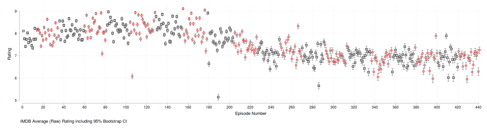
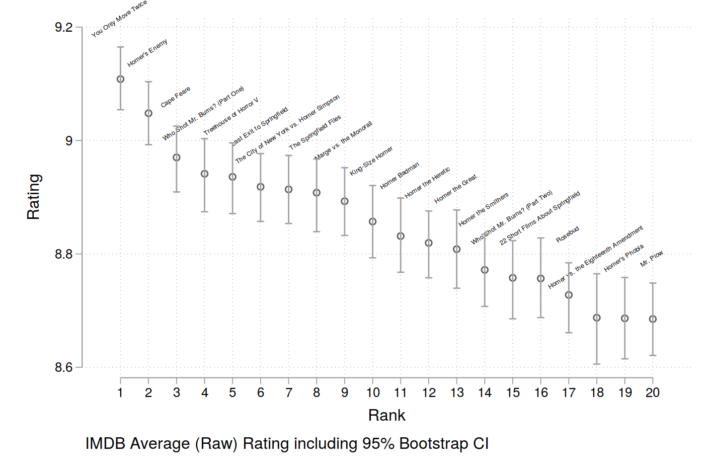

# Overview
This project analyses Simpsons Episodes Ratings from IMDB using Python3 and Stata 16. If you are using an older version of Stata this should not cause any issues as long as you install the ados which are mentioned in the comments.
Raw data is downloaded from IMDB using a Python script to collect the rating data. After that the information is processed in Stata. Here, mean ratings are calculated with bootstrap CIs for inference. Note that all results are restricted to the first 20 Seasons only (Why? We both know why).

- Information about episodes and links to IMDB ratings pages are stored in **episode_list.csv**. If anyone would want to add more seasons, do it in this file and rerun all analyses.
- **scrapping.py** is used to download the information and create a new file which combines the episode data with the ratings data in **ratingsadded.csv**. This process can take a few minutes due to the downloading and processing of the data.
- After this file is created, all analyses are done in Stata. A Stata project file is created in **simpsonsratings.stpr** for convenience.
- In Stata (use **Master.do** to set up the working folder), first run **simpsons_data.do**. This script imports the csv data and then proceeds to change the file format to prepare the bootstrapping. This creates a few large files so be careful here. The data format is clearly probably useful for this application only. For many other analyses, this reshaping won't be necessary.
- After the bootstrapping is performed, means and confidence bands are stored in a new Stata file, **ciresults.dta**. The information is then available for all episodes.
- The graphs are created using **episode_cis.do**.
- Analyses for seasons are done in **season_cis.do**.

# Methods

Raw information is downloaded from IMDB. This makes it possible to compute inference, for example the standard deviations and the overall distribution of ratings. I am a big fan of **bootstrapping** and used this technique to compute confidence bands around the means. I rely on BCa confidence bands using 1800 replications. More is probably overkill in this context. By doing so we can not only rank episodes but also see which ones are actually "the best". For example, when we look at the best episodes graph, we see that it is not possible to conclude that *You Only Move Twice* is actually the single best episode since CI bands overlap with *Homer's Enemy*. Summarized, these two are the best single episodes ever. *Cape Feare* no longer overlaps with the first rank and drops out of the race.

When we look at all episodes we can observe the drastic downfall after season ten. Personally, I consider seasons 1-12 as canonical, after that it gets really hard to watch. When we look at seasons as aggregated information from all episodes within a season, this becomes very clear. Computing CIs does actually not make much sense here since the differences between seasons are huge.

